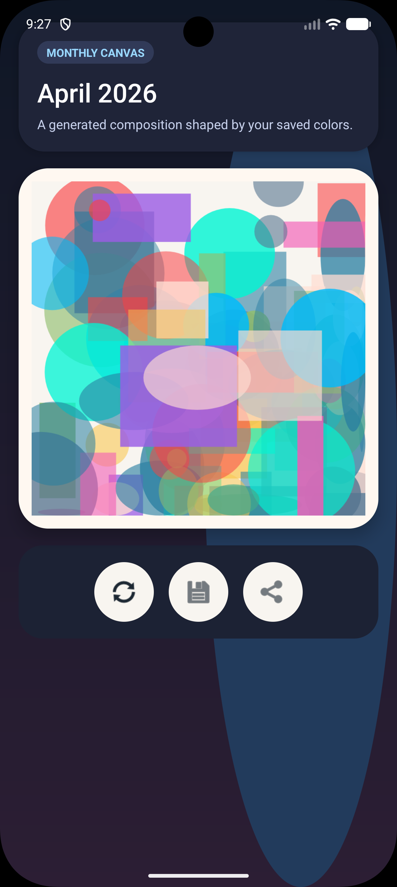
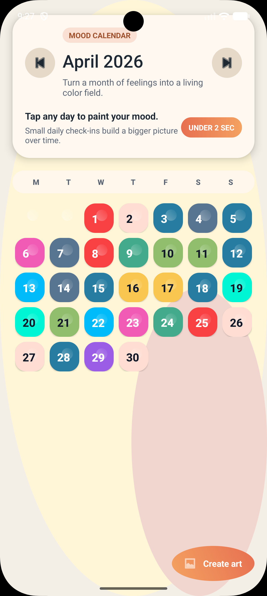

# MoodMosaic

MoodMosaic is a Java-based Android mood journal that helps users track feelings through color instead of text. Each day can be logged with a named mood and a matching color, creating a visual monthly calendar that can later be transformed into abstract mood art.

## Screenshots

### Home Screen


<<<<<<< HEAD
### Monthly Art Canvas


### Calendar View

=======
### Monthly Art Screen


### Calendar Grid

>>>>>>> 21e0266 ('updateds'')

## Features

- Daily mood logging with named preset moods and color-coded tiles
- Custom mood creation with RGB sliders and a custom mood label
- Monthly 7-column mood calendar
- Month-by-month mood history with quick jump-back navigation
- Multiple abstract art styles:
  - Constellation
  - Mosaic
  - Bands
- Export monthly mood data as CSV
- Save generated artwork as PNG
- Share artwork and monthly summaries
- First-launch onboarding and reopenable in-app help
- Local data storage with SQLite

## Tech Stack

- Language: Java
- IDE: Android Studio
- Minimum SDK: 24
- Target / Compile SDK: 35
- Database: SQLite with `SQLiteOpenHelper`
- UI: `RecyclerView`, `GridLayoutManager`, `CardView`, `ConstraintLayout`, `Spinner`
- Graphics: `Bitmap`, `Canvas`, `Paint`

## How It Works

### 1. Log a Mood
Tap any day in the month grid to open the mood picker.

Users can:
- choose one of the preset moods, each mapped to a color
- create a custom mood with a custom name and RGB-based color

### 2. Build a Visual Calendar
Each saved day appears as a colored square in the monthly grid, turning the calendar into a visual record of mood patterns over time.

### 3. Review Past Months
The History screen shows months that already contain mood entries, along with a quick summary of the number of entries and the top mood for that month.

### 4. Generate Mood Art
The Art screen reads the selected month's saved moods and generates abstract artwork using one of three styles:
- Constellation
- Mosaic
- Bands

### 5. Export and Share
Users can:
- export the current month's mood data as CSV
- save generated art to the gallery as PNG
- share generated art
- share a text summary of a month

## Project Structure

```text
app/
  src/main/
<<<<<<< HEAD
    java/moodmosaic/
=======
    java/com/moodmosaic/
>>>>>>> 21e0266 ('updateds'')
      MainActivity.java
      ArtActivity.java
      HistoryActivity.java
      MoodAdapter.java
      DatabaseHelper.java
      DayMood.java
      MoodOption.java
      MonthSummary.java
    res/
      layout/
      drawable/
      values/
```

## Key Files

- `MainActivity.java`
  Main calendar screen. Handles month navigation, onboarding, mood picking, export, and quick access to history and art.

- `ArtActivity.java`
  Generates abstract art from monthly mood data and supports style switching, saving, sharing, and export.

- `HistoryActivity.java`
  Displays month-by-month mood history and lets users reopen a saved month in the calendar.

- `MoodAdapter.java`
  Binds day cells into the monthly grid and displays saved mood colors.

- `DatabaseHelper.java`
  Creates and manages the SQLite database, including month summaries and mood history queries.

- `DayMood.java`
  Model for a single mood entry containing a date, color, and mood name.

- `MoodOption.java`
  Model for preset selectable moods in the picker.

- `MonthSummary.java`
  Model used by the history screen to represent one saved month.

## Setup

1. Open the project in Android Studio.
2. Let Gradle sync.
3. Make sure Android SDK 35 is installed.
4. Run the app on an emulator or Android device.

## Packaging

To build a downloadable APK in Android Studio:

1. Go to `Build` > `Build Bundle(s) / APK(s)` > `Build APK(s)`.
2. Wait for the build to finish.
3. Open the generated APK from:

```text
app/build/outputs/apk/debug/app-debug.apk
```

For wider distribution, generate a signed release APK from:

`Build` > `Generate Signed Bundle / APK`

## Notes

- The app is implemented in Java.
- Mood data is stored locally on-device.
- The app avoids text-heavy journaling in favor of fast visual check-ins.
- Screenshot paths in this README currently point to local image files on the original development machine.

## Possible Next Steps

- Add editable or deletable saved moods
- Add mood statistics and charts
- Add backup / restore
- Add cloud sync
- Add reminder notifications
